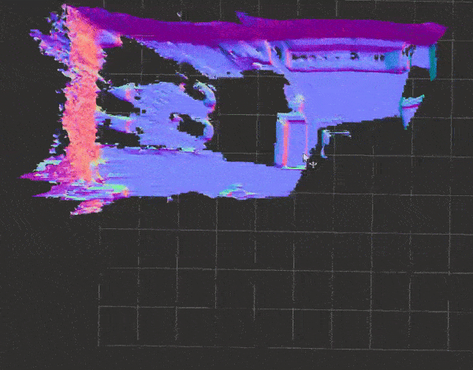

# ROS 1 Wapper Nvblox (Under Developping)

[Nvblox](https://github.com/nvidia-isaac/nvblox) is a package for building a 3D reconstruction of the environment around your robot from sensor observations in real-time. This repo is modified from ROS 2 wapper [Isaac ROS Nvblox](https://github.com/NVIDIA-ISAAC-ROS/isaac_ros_nvblox) and source [nvblox](https://github.com/nvidia-isaac/nvblox). 

#### Brief Explanation

Because I mainly focused on mapping, I removed the simulation and navigation modules from the [original ROS2](https://github.com/NVIDIA-ISAAC-ROS/isaac_ros_nvblox). Latest version [nvblox](https://github.com/nvidia-isaac/nvblox) has a weird problem when export target config when compiling, so I modify the cmakelists a little, I am not sure it is because my computer or not, so i directly upload nvblox fold now,  I will change to submodule in the future. Kudos to [nvblox](https://github.com/nvidia-isaac/nvblox) and [Isaac ROS Nvblox](https://github.com/NVIDIA-ISAAC-ROS/isaac_ros_nvblox). License as source code.

Below is an example of ROS 1 test on 3dmatch's [Sun3D](http://sun3d.cs.princeton.edu/) `mit_76_studyroom` scene:

<div align="center"></div>


## TODO

- [x] Test base 3dmatch_node function on 3dmatch data
- [ ] Test nvblox_node  on rosbag
- [ ] Add more function on EuRoc, KITTI and so on data.
- [ ] Add stereo depth map filter function

Because I have to go to intern next month for three months, so this repository may be updated slowly, feel free to contribute.

# Native Installation

## Install dependencies

You should install the dependencies as [nvblox](https://github.com/nvidia-isaac/nvblox) and install [ROS 1 melodic](http://wiki.ros.org/melodic/Installation/Ubuntu), also install catkin build tool `sudo apt-get install python-wstool python-catkin-tools`.

## Build and run test

```
# Build
mkdir -p ~/nvblox_ws/src
cd ~/nvblox_ws/src/
git clone --recursive https://github.com/hjxwhy/nvblox_ros1.git
cd nvblox_ros1/nvblox/nvblox
mkdir build && cd build
cmake ..
make -j8
cd ~/nvblox_ws
catkin build
# test
# You should download the data, and copy the data path to nvblox_ros/launch/3dmatch.launch
source devel/setup.zsh # source devel/setup.bash
roslaunch nvblox_ros 3dmatch.launch # I have only test 3dmatch_node, the nvblox_node still have bug!!!
```

